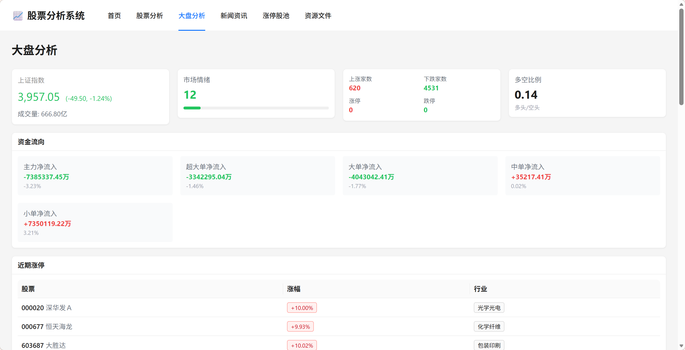
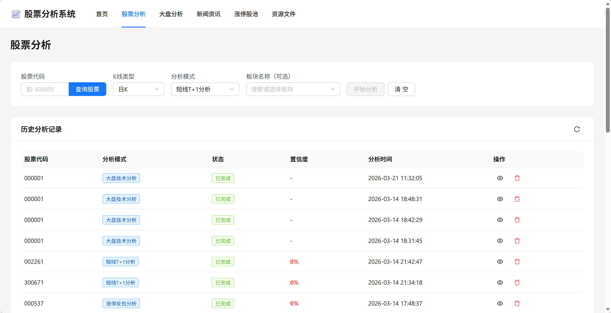

# Stock Analysis System

一个集数据采集、技术指标计算、AI智能分析和可视化展示于一体的综合性金融分析平台。





## 📋 项目概述

**核心目标**：
- 自动化采集上证指数及个股的K线数据、成交数据和大盘情绪数据
- 计算MACD、KDJ等技术指标
- 基于AI分析生成市场走势和个股分析报告
- 爬取财经新闻并提取潜在投资机会
- 提供友好的Web界面进行交互和结果展示

**关键特性**：
- ✅ FastAPI 后端框架
- ✅ React + TypeScript 前端
- ✅ MySQL + Redis 数据存储
- ✅ LLM AI 分析能力
- ✅ Docker 容器化部署
- ✅ 完整的技术指标计算
- ✅ 大盘多维度分析
- ✅ 个股分析报告生成

## 🏗️ 项目结构

```
stock-analysis-system/
├── backend/                    # Python FastAPI 后端
│   ├── app/
│   │   ├── api/               # API 路由
│   │   ├── services/          # 业务逻辑
│   │   ├── models/            # ORM 模型
│   │   ├── db/                # 数据库相关
│   │   ├── utils/             # 工具函数
│   │   ├── main.py            # FastAPI 主应用
│   │   └── config.py          # 配置管理
│   ├── tests/                 # 单元测试
│   ├── requirements.txt       # Python 依赖
│   └── .env.example           # 环境变量示例
│
├── frontend/                   # React TypeScript 前端
│   ├── src/
│   │   ├── pages/             # 页面组件
│   │   ├── components/        # 可复用组件
│   │   ├── services/          # API 服务
│   │   ├── hooks/             # 自定义 Hook
│   │   ├── store/             # Zustand 状态管理
│   │   ├── types/             # TypeScript 类型
│   │   ├── styles/            # 样式文件
│   │   ├── App.tsx            # 根组件
│   │   └── main.tsx           # 入口文件
│   ├── public/                # 静态资源
│   ├── package.json           # Node 依赖
│   └── vite.config.ts         # Vite 配置
│
├── memory-bank/               # 项目文档
│   ├── implementation-plan.md # 实施计划
│   ├── stock-design-document.md # 设计文档
│   ├── tech-stack.md          # 技术栈推荐
│   ├── architecture.md        # 架构文档
│   └── progress.md            # 项目进度
│
├── docker-compose.yml         # Docker 容器编排
├── nginx.conf                 # Nginx 配置
└── README.md                  # 本文件
```

## 🚀 快速开始

### 前置要求
- Python 3.10+
- Node.js 16+
- Docker & Docker Compose (可选)
- MySQL 8.0+
- Redis 7.0+

### 本地开发设置

#### 1. 后端设置

```bash
# 进入后端目录
cd backend

# 创建虚拟环境
python -m venv aistock_env
source aistock_env/bin/activate  # Linux/Mac
# 或
aistock_env\Scripts\activate     # Windows

# 安装依赖
pip install -r requirements.txt

# 配置环境变量
cp .env.example .env
# 编辑 .env 文件，配置数据库和 API 密钥

# 启动 FastAPI 服务
uvicorn app.main:app --reload --host 0.0.0.0 --port 8000
```

API 文档：http://localhost:8000/docs

#### 2. 前端设置

```bash
# 进入前端目录
cd frontend

# 安装依赖
npm install

# 启动开发服务器
npm run dev
```

应用访问：http://localhost:5173

### Docker 部署

```bash
# 启动所有服务
docker-compose up -d

# 查看日志
docker-compose logs -f

# 停止所有服务
docker-compose down
```

访问：http://localhost

## 📚 文档

- [实施计划](memory-bank/implementation-plan.md) - 13周项目计划
- [设计文档](memory-bank/stock-design-document.md) - 详细功能设计
- [技术栈](memory-bank/tech-stack.md) - 推荐技术栈和依赖
- [架构文档](memory-bank/architecture.md) - 系统架构设计

## 🔧 主要功能

### 后端功能
- **数据采集**：基于 akshare 的多源数据集成
- **技术指标**：MACD、KDJ、RSI 等指标计算
- **AI 分析**：LLM 驱动的智能分析
- **任务调度**：定时数据采集和处理
- **API 服务**：RESTful API 接口

### 前端功能
- **股票分析**：单只股票深度分析
- **大盘分析**：市场全景数据展示
- **新闻资讯**：财经新闻聚合
- **涨停股池**：实时涨停股票列表
- **数据可视化**：ECharts 专业图表

## 🛠️ 技术栈

### 后端
- **框架**：FastAPI
- **数据处理**：Pandas, NumPy
- **数据源**：akshare
- **技术指标**：pandas-ta
- **LLM**：LangChain + OpenAI/GLM
- **数据库**：MySQL, Redis
- **任务调度**：APScheduler

### 前端
- **框架**：React 18
- **语言**：TypeScript
- **构建**：Vite
- **路由**：React Router
- **状态管理**：Zustand
- **图表**：ECharts
- **UI 库**：Ant Design
- **样式**：Tailwind CSS

### 基础设施
- **容器化**：Docker
- **编排**：Docker Compose
- **反向代理**：Nginx
- **监控**：Prometheus + Grafana

## 📊 API 端点示例

```bash
# 股票分析
POST /api/v1/analysis
GET /api/v1/analysis/{analysis_id}
GET /api/v1/analysis/history

# 股票数据
GET /api/v1/stocks/{code}/kline
GET /api/v1/stocks/{code}/indicators
GET /api/v1/stocks/{code}/company-info

# 大盘数据
GET /api/v1/market/sentiment
GET /api/v1/market/fund-flow
GET /api/v1/market/activity
GET /api/v1/market/limit-up

# 新闻数据
GET /api/v1/news/latest
GET /api/v1/news/{id}
```
